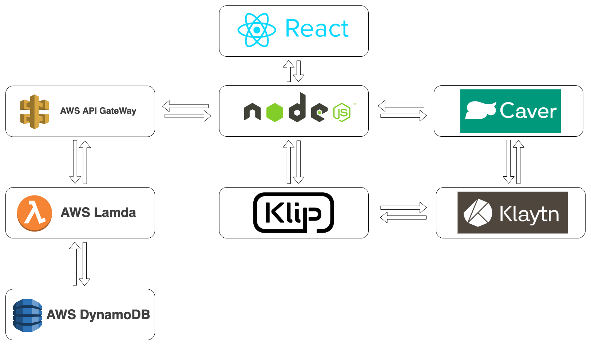

# Ticket-Chain

티켓을 쉽게 관리할 수 있는 어플이 없다. 또 티켓을 미리 사둔 후 거래하는 경우도 많다. 복잡하고, 신빙성 없게 티켓을 거래하는 것이 아니라 블록체인 기술을 활용해 티켓을 확실하게 거래할 수 있으면 좋을 것 같다.

## UI

Figma를 활용한 UI 설계

## Contract

KIP17을 활용한 Smart_Contract 설계

## Stack

| 사용 스택 | 활용 방안                                         |
| :-------- | :------------------------------------------------ |
| Klaytn    | Cypress MainNet을 사용                            |
| CaverJS   | klaytn node api를 이용하여 블록체인 데이터를 읽음 |
| Klip API  | 사용자의 Klip계정 권한을 사용할 수 있도록 함      |
| NodeJS    | API를 호출하고, 데이터를 파싱함                   |
| ReactJS   | 유저에게 보여줄 화면 생성                         |

## Requirement

NodeJS V.16

## Todo

[x] Smart Contract -> burn 기능 구현 ( sub error )
[] 현재 티켓 정보가 blockchainNetwork에 직접 들어감. 이를 URI로 수정할 필요가 있음.
[] 중복되는 정보의 티켓도 모두 모든 정보를 담고 있음. 이를 티켓ID등으로 묶어 낭비되는 저장공간을 줄일 필요가 있음.
[] 로그인, 티켓 구매 등 정보가 바뀌었을 때 컴포넌트가 새로고침이 되지 않음. 수정 필요
